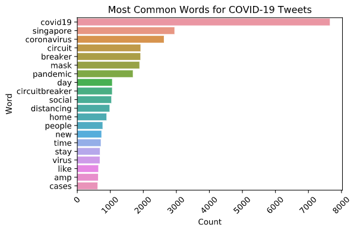
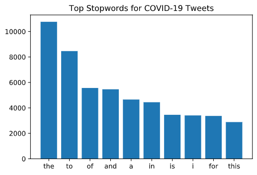
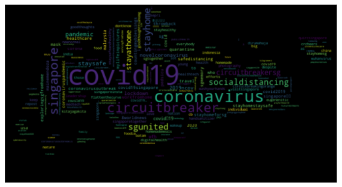

## Exploring Impact of COVID-19 on Singapore Public Trends

### Project Goals
To identify how the Singapore public mobility as well as search trends and twitter content change throughout the COVID-19 period.

### Tweets Cleaning and EDA
Here I cleaned the tweets by removing unwanted text such as punctuations, stopwords and segmenting hashtag words. I also looked at the some of the most commong stopwords, words and hashtags. Finally, sentiment scores were computed from the tweets to get the polarity (which rates how negative or positive a tweet is).

<figure>

<figcaption>Most Common Hashtag</figcaption>
</figure>

### Future Work
